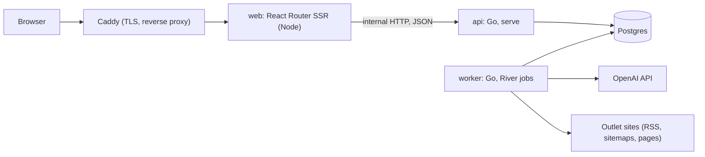

# Tech stack

Versions below were checked in September 2026. Re-check at scaffold time and pin exact versions in `go.mod` and `package.json`.

## Overview



Three processes, one database. The Go `api` and `worker` are the same binary with different subcommands. The browser only ever talks to `web`; `web` calls the Go API from its route loaders, so there is no CORS and the API is not exposed publicly.

## Backend

| Concern | Choice | Why |
| --- | --- | --- |
| Language | Go (1.25 or later; the current `openai-go` requires it) | Decided |
| HTTP | Standard library `net/http` with `ServeMux` method and wildcard patterns | The API is small and read-mostly; a framework adds nothing. Add `chi` only if middleware grouping gets awkward |
| Postgres driver | `pgx` v5 with `pgxpool` | The standard driver; River supports it directly |
| Queries | `sqlc` generating typed Go from SQL files | Plain SQL stays readable and reviewable; no ORM |
| Migrations | `goose`, SQL files, run by the `migrate` subcommand | River ships its own migrations, run the same way |
| Event candidate search | Postgres full-text search: a generated `tsvector` over event title (weight A) and timeline text (weight B), GIN-indexed, queried with OR-ed terms and ranked by `ts_rank` | Titles, timelines and recaps are our own English text, so the built-in English configuration works. No embeddings, extension or extra model; see the plan review notes in [README.md](README.md) |
| Fuzzy entity lookup | `pg_trgm` on entity names and aliases | Matches nicknames and partial names without another service |
| Job queue | River (`riverqueue/river` with `riverpgxv5`) | Postgres-backed, transactional enqueue, retries, unique jobs, periodic jobs. No Redis |
| AI | `openai-go` (official SDK) against an OpenAI-compatible **chat-completions** endpoint, with strict JSON-schema Structured Outputs | The endpoint is configurable (`OPENAI_BASE_URL`); development uses a LiteLLM proxy, which speaks chat-completions rather than the Responses API |
| Feeds | `mmcdole/gofeed` for RSS and Atom; standard `encoding/xml` for news sitemaps (with `<news:title>`) and sitemap indexes | Most Taiwanese outlets publish a Google News sitemap and no usable RSS |
| robots.txt | `temoto/robotstxt` | Plan requires respecting robots.txt |
| Article extraction | `go-readability` (the maintained `codeberg.org/readeck` fork) as the default, plus per-outlet CSS selectors (`PuerkitoBio/goquery`) in `outlets.crawl_config` where readability fails. General cleanup drops repeated headlines, bare timestamps, photo captions and trailing "read more" blocks | Taiwanese outlet pages vary a lot; expect overrides |
| Near-duplicate detection | MinHash over character 5-gram shingles, implemented in-house (about 100 lines) with signatures stored on `articles` | Character shingles work for Chinese without a word segmenter |
| Logging | `log/slog`, JSON in production | Standard library |
| Config | Environment variables, parsed once at startup into a struct | |
| Tests | Standard `testing`. HTTP handlers depend on a small store interface and are tested with a fake; database-backed tests run against `TEST_DATABASE_URL` when set. Recorded OpenAI responses as fixtures | Never call OpenAI in CI |

### The pipeline as River jobs

Each step in the plan's pipeline is one job kind. A job does its work and enqueues the next job in the same transaction, so a crash never loses or duplicates an article.

| Job | Trigger | Does | Enqueues |
| --- | --- | --- | --- |
| `crawl_all` | Periodic, every 5 minutes | Lists enabled outlets | `crawl_outlet` | From `crawl_all` or backfill | Discover feeds, sitemaps and lists; commit URLs and resumable source progress | `dispatch_fetch` periodically drains stored URLs |
| `crawl_outlet` | From `crawl_all` | Reads RSS or sitemaps through the fetcher (robots.txt, Content-Signal, per-host delay); finds unseen URLs; enqueues at most `CRAWL_MAX_NEW_PER_RUN` | `fetch_article` per new URL (unique by URL) |
| `fetch_article` | From crawl | Fetches the page, extracts headline, body, published time; stores the article | `dedupe_article` | From fetch | Compare recent MinHash signatures; exclude reprints from paid analysis | Durable analysis-ready record |
| `dedupe_article` | From fetch | MinHash comparison against recent articles; sets `reprint_of_id`; credits Yahoo reprints to the original outlet | `summarize_article` (skipped for reprints) |
| `summarize_article` | From dedupe | One OpenAI call: summary, new development and its date, entities, recapped earlier steps. Cached by content hash | `link_article` |
| `link_article` | From summarize | Candidate lookup (shared entities + full-text search), model decision, attach or create event, rewrite the event's `timeline_text`, title call for new events | none |

`dispatch_analysis` runs every five minutes, fairly admits at most 20 waiting articles per run, and reserves a configurable 500 daily article slots in the same transaction as enqueue. The day is Asia/Taipei. No key means crawling continues and AI work pauses, unless `ALLOW_FAKE_AI=true` explicitly selects development mode. See [outlets.md](outlets.md) for operations.

Rate limits are handled by River queue concurrency (two workers on the `ai` queue) and by the fetcher's per-host delay of 3 seconds, so no outlet is hit hard.

The `link` queue has exactly one worker. Two articles about the same brand-new story, linked at the same moment, would each find no candidate and both create an event; serializing the link step rules that out, and at a few seconds per decision it keeps up with the MVP's volume.

No transaction is ever held open across a model call: a worker reads, calls the model, then opens a transaction to write the result and enqueue the next job. Every worker is idempotent, because River re-runs a job whose process died. The summarize job reuses a stored summary when its model and prompt version match, so a retry never pays for the same article twice.

`app crawl-check <slug>` runs discovery and one extraction for an outlet without storing anything. Use it before enabling an outlet; see [outlets.md](outlets.md).

### The AI interface

All model calls sit behind one interface in `internal/ai`, as the plan requires. The rest of the code never imports the OpenAI SDK.

```go
type Client interface {
    SummarizeArticle(ctx context.Context, in ArticleInput) (ArticleAnalysis, error)
    LinkToEvent(ctx context.Context, in LinkInput) (LinkDecision, error)
    TitleEvent(ctx context.Context, in TitleInput) (string, error)
}
```

Rules:

- Structured Outputs for every call. The Go structs that define the JSON schema must not use `omitempty`; the SDK's schema generator treats it as "optional" and the API may reject the schema or silently skip fields.
- Prefer a dated model snapshot over an alias. The current proxy exposes aliases only (`rlongAI/gpt-5.5`), so the model behind a name can change; `model` and `prompt_version` are recorded on every summary so drift can at least be traced.
- Prompts live in versioned files under `internal/ai/prompts/`, not inline strings, so a prompt change is a reviewable diff.
- Cache by hash of (prompt version, model, article content hash).

### HTTP API

JSON over HTTP under `/api/v1`, read-only for the public site. The contract is written by hand in `api/openapi.yaml`, and the frontend's TypeScript types are generated from it with `openapi-typescript`, so the two sides cannot drift silently.

| Endpoint | Returns |
| --- | --- |
| `GET /api/v1/events?cursor=` | Events, most recently updated first, cursor-paginated |
| `GET /api/v1/events/{id}` | One event: title, timeline steps, articles with summaries, wire reprints grouped |
| `GET /api/v1/outlets` | The outlet list |
| `GET /api/v1/admin/session` | 204 when the token is valid; used by the login form |
| `GET /api/v1/admin/links?max_confidence=` | Link decisions, least confident first |
| `GET /api/v1/admin/events?q=` | Event search by title or id, for choosing a merge or move target |
| `POST /api/v1/admin/events/{id}/merge` | Merge another event into this one |
| `POST /api/v1/admin/articles/{id}/move` | Move an article to another event, or to a new one. If it was a timeline step that others attach to, the earliest of them takes the step over; an event left empty is deleted |

Article `body` is stored for processing but never returned by any endpoint; the plan forbids republishing article text.

Admin auth for the MVP is a single long random token from the environment (`ADMIN_TOKEN`), compared in constant time by middleware on `/api/v1/admin/*`. Without a token the admin routes are not registered at all. The admin UI has a login form that stores the token in an HTTP-only, `SameSite=Strict` cookie on the `web` server, which forwards it as a bearer token; it never reaches browser JavaScript. Replace it with real accounts only when there is more than one admin.

## Frontend

| Concern | Choice | Why |
| --- | --- | --- |
| Language | TypeScript, `strict` on | |
| Build | Vite | Decided |
| UI library | React | Decided |
| Routing, data, SSR | React Router in framework mode (`@react-router/dev` Vite plugin) | See below |
| UI primitives | Base UI, `@base-ui/react` (stable, v1.x) | Decided. Unstyled and accessible; we supply all M3 visuals |
| Styling | CSS Modules + CSS custom properties | Base UI exposes state as data attributes (`[data-checked]`, `[data-open]`), which plain CSS handles directly. M3 is a token system, and CSS variables are the natural form for tokens. Tailwind would put a second, competing token vocabulary on top |
| Theme generation | `@material/material-color-utilities`, run by a build script that writes `tokens.css` | Official M3 color algorithm; no runtime cost |
| Icons | Material Symbols (Rounded), imported as individual SVGs | The M3 icon set; per-icon SVGs avoid shipping the full icon font |
| Fonts | Roboto (Latin subset) self-hosted via Fontsource; Chinese text uses the platform's Traditional Chinese font | A CJK webfont added about 430 KB of CSS alone; see [design-system.md](design-system.md#typography) |
| i18n | A typed message catalogue per locale in `web/app/i18n/`, no library | English is the source locale and defines the `Messages` type, so a missing key in another locale is a compile error. Messages that need plurals or interpolation are functions. Locale comes from a cookie, read in the root loader |
| Data fetching | React Router loaders and actions only | With loaders there is no need for a client cache library in the MVP |
| Dates | `Intl.DateTimeFormat` in the UI locale, always in `Asia/Taipei` | No date library needed; fixed zone and locale so server and client render the same text |
| Lint and format | Biome | One tool, fast |
| Tests | Vitest + Testing Library + `axe` for components (`pnpm test`); Playwright end-to-end tests against a running, seeded site at desktop and phone sizes (`pnpm e2e`), covering the public pages, language and theme switching, and the admin move-and-merge flow | |
| Package manager | pnpm | |

### Rendering: SSR with React Router framework mode

React Router has three modes; framework mode wraps the router in a Vite plugin and adds SSR, code splitting and typed route modules. It is still "React + Vite": Vite is the dev server and bundler, and the app is ordinary React components.

How a request flows:

1. The browser requests `/events/123`.
2. The `web` process runs the route's `loader`, which fetches `GET /api/v1/events/123` from the Go API over the internal network.
3. React renders to HTML on the server, including `<title>`, description and Open Graph tags from the route's `meta` export.
4. The browser hydrates. Later navigations fetch only loader data, not full pages.

Alternatives considered:

| Option | Verdict |
| --- | --- |
| Client-only SPA served by Go | Simplest to deploy, but no link previews on LINE or Facebook and weak SEO. Not acceptable for a news site |
| SPA plus Go injecting meta tags into `index.html` | Fixes link previews but not content indexing, and duplicates routing logic in Go |
| Build-time prerendering | Events update every few minutes; a static build can't keep up |
| Next.js | Not Vite; ruled out by the stack decision |

If running Node in production ever becomes a problem, the same app can be switched to `ssr: false` and served as static files by Go, with no component changes. That makes this a low-regret choice.

### Base UI setup requirements

From the Base UI quick start:

- Wrap the app in a root element with `isolation: isolate` so portaled popups always stack above page content without z-index fights.
- Set `position: relative` on `body`; iOS 26+ Safari needs it for dialog backdrops to cover the visual viewport.
- Style through `className` (string or a function of component state), data attributes, and the CSS variables components expose (such as `--available-height` and `--anchor-width`).
- Animate with CSS transitions keyed on Base UI's `[data-starting-style]` and `[data-ending-style]` attributes, using M3 motion tokens. No animation library.
- Never render a link through `Button`. Base UI is explicit that links have their own semantics, so a link that looks like a button is an `<a>` (or React Router `<Link>`) sharing the button's styles: see `ButtonLink` and `ExternalButtonLink`.

## Infrastructure

- **Local development:** Docker Compose runs Postgres (the stock `postgres:17` image). `go run ./cmd/app serve`, `go run ./cmd/app worker` and `pnpm dev` run on the host. Vite proxies nothing; loaders call the API at `API_URL`.
- **Production (assumed single VPS):** `compose.prod.yaml` runs `caddy`, `web`, `api`, `worker`, a one-shot `migrate`, and `postgres`. Caddy (`deploy/Caddyfile`) obtains the certificate for `SITE_ADDRESS` and proxies everything to `web`; the API has no public port. The backend image is distroless and about 35 MB. Backups (a nightly `pg_dump` to object storage) are not set up yet.
- **CI:** `.github/workflows/ci.yml` has three jobs. `backend`: gofmt, `go vet`, `sqlc diff`, and `go test` with a Postgres service for the database-backed tests. `web`: generated API types are current, Biome, typecheck, Vitest, build. `e2e`: migrates and seeds a database, starts the API and the built web app, and runs Playwright.

## Repository layout

```
.
├── api/
│   └── openapi.yaml            # the HTTP contract; TS types are generated from it
├── cmd/
│   └── app/                    # main: serve | worker | migrate
├── internal/
│   ├── ai/                     # Client interface, OpenAI implementation, prompts/
│   ├── crawl/                  # feeds, sitemaps, robots, fetch, extraction
│   ├── dedupe/                 # MinHash
│   ├── link/                   # candidate lookup and event linking
│   ├── jobs/                   # River workers, one file per job kind
│   ├── httpapi/                # handlers, middleware
│   └── db/                     # sqlc output, queries/*.sql
├── migrations/                 # goose SQL
├── web/
│   ├── app/
│   │   ├── routes/             # home, event, outlets, about, admin
│   │   ├── components/         # M3 components built on Base UI (see components.md)
│   │   ├── i18n/               # locales.ts, messages/en.ts (source), messages/zh-TW.ts
│   │   ├── theme/              # colors.css (generated), tokens.css, typography.css, base.css
│   │   └── root.tsx
│   ├── scripts/generate-theme.ts
│   └── vite.config.ts
├── docs/
├── compose.yaml
└── sqlc.yaml
```

One repo, one Go module, one pnpm package. Split only when something forces it.
