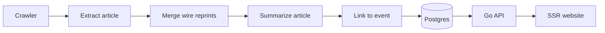

# Ground News for Taiwan — MVP Plan

## What it is

A website that shows every outlet's coverage of the same event, with a short summary of each article, so readers can compare them and see the bias for themselves.

Core principle: the site never labels, scores or judges an outlet or article. It puts the coverage side by side; readers decide.

The MVP is four things: events, a timeline of each event's developments, every outlet's articles on each event, and a summary of each article.

## Event page

The homepage lists current events, most recently updated first. Each event page shows the event timeline at the top, then every article about the event. Each article shows:

- Outlet name
- Original headline, unchanged
- Published time
- Summary of the article, 2–4 sentences
- Link to the original article

**When** several outlets run the same wire story (e.g. one Central News Agency report), it appears once, with every outlet that ran it listed.

## Event timeline

The timeline tracks what happened in the event, not when articles were published. Each step is one development, with the date it happened and the outlets that reported it.

Example, for a drug case:

1. Police find a person suspected of drug use
2. The person is arrested and referred to prosecutors
3. Prosecutors indict them under the Narcotics Hazard Prevention Act
4. The court holds a hearing

How steps are built:

- For each article, the same OpenAI call that writes its summary extracts the new development it reports and the date it happened, ignoring recaps of earlier steps.
- A step is an article: the first article to report a development. Later articles reporting the same development attach to it.
- Articles that report no new development, such as explainers or side stories, stay in the article list without a step.
- If the date is unclear, the step uses the first report date and marks it as approximate.

The timeline is the one place the site speaks in its own voice, so each step is one short, neutral line checked against its source articles. Use precise legal stages (referral to prosecutors, detention, indictment, verdict, final judgment) and keep accusations attributed ("police allege," "prosecutors charge") until there's a verdict.

## Linking new developments to older events

A new development joins its original event no matter how long the gap, so readers see the full timeline instead of a new event with no context.

How a new article is matched:

1. **Find candidates.** Look up events that share the article's key people, organizations or places, plus events whose title and timeline match the article's development and recap lines in a full-text search. There is no time limit.
2. **Use the recap.** Follow-up articles usually recap earlier steps, such as "arrested last month for drug use." The model extracts these recaps, and matching them against existing timeline steps is the strongest linking evidence.
3. **Let the model decide.** Give the model the article plus the top 3–5 candidate events with their timelines. It picks one or answers "new event," with a confidence level.

Shared names alone never merge events, since one person can appear in several unrelated events. Because the homepage sorts by latest update, a dormant event that gets a new step returns to the top with its full timeline. A simple admin tool to merge events or move an article fixes the mistakes the model will make.

## Per-article summaries

Each summary must keep the article's own framing. If the summary neutralizes the article, readers can no longer see its bias.

Rules for the summary prompt:

- Summarize only this article; never add facts from other articles.
- Keep what the article emphasizes, in the order it does.
- Name who the article quotes.
- Keep the article's own terms: if it says "the mainland" rather than "China," so does the summary.
- Never correct, balance or comment on the article.

Summaries are short and in our own words, pointing readers to the original rather than replacing it; article text is never republished. Spot-check about 20 summaries a week against the originals.

## How it works

A Go backend with Postgres. One OpenAI-compatible endpoint is the only AI provider. There are no embeddings in the MVP: candidate events are found with shared entities and Postgres full-text search, which works because titles, timeline lines and recaps are all the site's own English text. If the admin merge tool shows linking misses too many follow-ups, vector search can be added later with one migration. Model calls sit behind one small interface so another provider could be added later, but the MVP integrates no other platform.

| Step | What it does |
| --- | --- |
| Crawler | Fetches each outlet's RSS, sitemap or pages every 5–10 minutes; respects robots.txt |
| Extract article | Pulls headline, body, published time and URL |
| Merge wire reprints | Detects near-identical text with MinHash; credits Yahoo News Taiwan reprints to the original outlet |
| Summarize article | One OpenAI call per article returns its summary, the new development it reports and its date, the key people and organizations it names, and any earlier steps it recaps; Structured Outputs, a pinned model snapshot, cached by content hash |
| Link to event | Links the article to an existing event of any age, or starts a new one (see Linking new developments to older events); one extra call per new event for a short factual title |
| Frontend | Server-rendered pages with React + Vite (React Router framework mode), Base UI components, Material Design 3; see `docs/` |

## Data model

Six tables cover the MVP. A timeline step is an article, so there's no separate steps table.

| Table | Holds | Key fields |
| --- | --- | --- |
| outlets | News sources | name, domain, crawl config |
| articles | One row per article; also the timeline steps | outlet\_id, event\_id, url, headline, body, published\_at, first\_seen\_at, reprint\_of\_id, development (empty if none), happened\_on, date\_is\_approximate, step\_article\_id (the first article that reported this development) |
| events | Long-running events | title, first\_seen\_at, updated\_at, timeline\_text and a full-text search index over title and timeline |
| summaries | One summary per article | article\_id, text, recapped earlier steps, model, prompt\_version |
| entities | People, organizations and places | canonical name, aliases (e.g. a nickname and a full name) |
| event\_entities | Which entities each event involves | event\_id, entity\_id |

## Outlets

Start with about 20 outlets, each checked for a working feed or crawlable pages:

Central News Agency (CNA), PTS News, United Daily News (UDN), Liberty Times, China Times, ETtoday, SETN, TVBS News, EBC News, FTV News, CTi News, Mirror Media, Storm Media, Up Media, Newtalk, NOWnews, The News Lens, The Reporter, CommonWealth Magazine.

Yahoo News Taiwan is crawled only to find articles; each one is credited to its original outlet.

